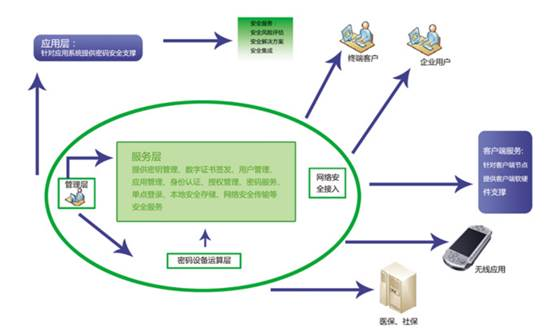
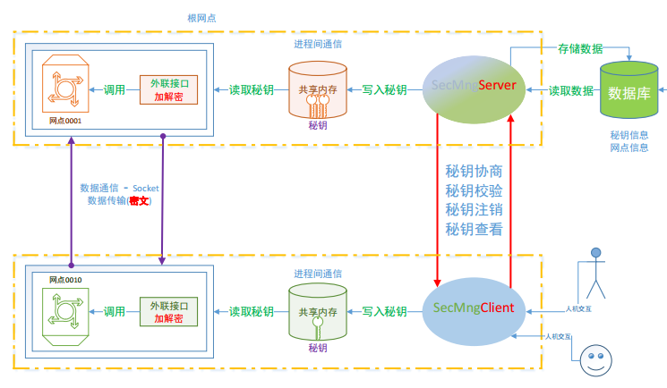
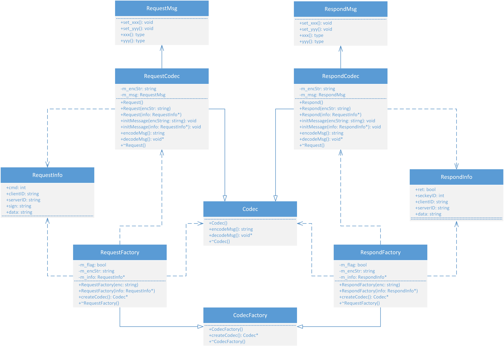
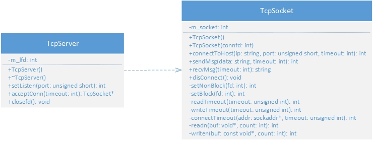
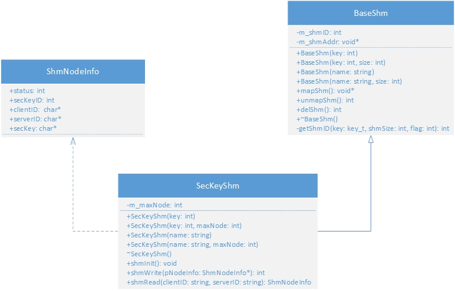

## 一、前言
　　该项目是我在全面、系统地学习完Linux系统编程和网络编程后，在网上找的开源项目，也是我的练手项目之一。该项目是一个典型的C/S模型的全栈项目，涉及到**TCP/IP网络通信**、**多线程并发**、**OpenSSL数据的加解密**、**Protobuf序列化与反序列化**、**MySQL数据库**等众多知识点，因为觉得这个项目具有较强的综合性和可拓展性，因此将其作为我的Linux C++练手项目，项目从开始到完成一共经历了三个月时间，在这三个月里，我重写了该项目的全部源代码，对代码的可维护性以及程序的执行效率做出了改进和优化，并在源代码的基础上增加了更多的功能。在这段时间里，我每天都沉浸在项目相关知识点的学习中，虽然在做项目的过程中遇到了不少困难，但是最终也都一一解决了，遇到知识盲区就去学，遇到bug就去查，这在一定程度上也锻炼了我分析问题、解决问题的能力，该项目让我更加熟悉了Linux环境下C/C++的开发，让我对高并发通信有了更深刻的理解。项目完成后，无论是在Linux操作系统的使用方面、项目开发环境的部署方面还是C++本身的代码能力方面，我认为我都有了一个不小的进步。
## 二、项目简介
　　根据我对该项目的理解，我将其命名为**SecureTransferPlatform（密钥协商安全传输平台）**，该项目是一款基础设施类项目，可以为各集团、企业的信息系统提供统一、标准的信息安全服务，以解决企业和企业之间或集团内部之间，数据的本地存储、网络传输、身份认证、数据完整性等安全问题。简而言之，就是为第三方信息系统**提供加密算法和密钥，解决密钥分发困难问题，保证第三方信息系统点到点的安全通信**。该项目不仅可面向具有高安全性和高性能需求的电子商务、电子政务领域应用，还可以应用于各种"云"中心、"云"节点中，典型的应用场景图如下图所示。



## 三、项目整体架构



　　以上是这个项目的整体架构图，整体上分为五个部分，分别为第三方信息系统的客户端与服务端、密钥协商系统的客户端（SecMngClient）与服务端（SecMngServer）以及密钥协商服务器的配置终端。第三方信息系统是这个项目的服务对象，最终目的就是为其提供信息的安全传输功能。密钥协商服务器以及密钥协商客户端是项目的核心模块，这两个模块需要分别部署在第三方信息系统所在的两台主机上，通过密钥协商功能，在各自所在的主机上生成密钥，存储在共享内存中，并通过提供外联接口，对第三方信息传输系统的数据进行加解密操作。密钥协商服务器配置终端用来管理接入系统的网点应用，负责网点生命周期的管理，具备历史密钥管理、网点审批等功能。

## 四、项目部署方案

　　在这里我以两个网点之间的应用为例来说明项目的部署方案，假设现在第三方信息系统为某银行内部的信息管理系统，位于北京的总行需要和位于广州的分行进行数据通信，在通信时需要用到数据加解密服务，此时项目的部署流程为：

1. 在北京总行网点所在的硬件服务器上，部署该项目的外联接口（AppInterface）和密钥协商服务器程序（SecMngKeyServer）。
2. 在广州分行网点所在的硬件服务器上，部署该项目的外联接口（AppInterface）和密钥协商软件客户端程序（SecMngKeyClinet），密钥协商软件客户端可部署在Windows平台或Linux平台。
3. 两个网点在进行通信之前，需首先使用密钥协商客户端对秘钥协商服务器进行秘钥协商，生成数据加密所需的密钥。
4. 位于北京和广州的网点应用通过调用外联接口（AppInterface）进行数据的加解密操作。

## 五、模块划分及功能介绍

　　该项目主要由四大基础模块组成，分别为基础组件部分、密钥协商服务器&&客户端、配置管理终端以及外联接口。基础组件部分针对各个功能模块的底层逻辑进行了封装，为业务模块提供了包括数据序列化、套接字通信、共享内存和数据库操作在内的基础功能。密钥协商服务器和客户端实现了主要的业务逻辑，用于解决密钥分发困难的问题，为数据的加解密操作提供密钥，具备密钥协商、密钥校验和密钥查看等功能。配置管理终端具备历史密钥管理、网点审批等功能，用于管理后台数据库，外联接口可以为第三方信息传输系统提供数据加解密操作，是第三方应用程序调用本项目加解密模块的主要途径。

1. 基础组件部分

   - 数据序列化模块

     　　　　该模块主要解决数据的跨平台传输问题，涉及到主机字节序和网络字节序的相互转换、字节对齐、序列化与反序列化等内容。原项目中使用了抽象语法标记**ASN.1**编写该模块，但是底层需封装较多的细节，编写代码的难度较高并且较为复杂，因此我在该项目中使用**Google Protobuf**技术进行了替代，protobuf可以让我们自己定义数据的结构，然后通过使用特殊编译器生成源代码的方式让我们对数据进行序列化和反序列化操作，操作简单并且效率较高，该模块的UML类图如下：

     

   - 套接字通信模块

     　　　　该模块对C++中原生**Socket API**进行了封装，提供了两个类，分别为**TcpSocket**和**TcpServer**。TcpSocket类基于TCP/IP协议实现了基础的通信功能，包括向指定IP和端口的进程建立连接、发送数据、接收数据、断开与进程的连接等，TcpServer类针对密钥协商服务器的业务逻辑，对TcpSocket类进行了更深层次的封装，实现了设置监听、等待客户端连接等功能，以下展示了这两个类的UML类图：

     

   - 共享内存操作模块

     　　　　本项目使用由System V版本的Unix引入的**共享内存(shm)**来实现进程间通信，之所以选用共享内存来实现进程间通信，是因为它的效率是最高的，相较于其他进程间通信方式（如管道、内存映射等），共享内存在实现时不依赖于文件描述符(fd)，即不需要对磁盘文件进行操作，而是直接为两个需要通信的进程共同安排同一块物理内存，因此效率最高。项目中提供了三个与共享内存操作相关的类，分别为**BaseShm**、**SecKeyShm**和**ShmNodeInfo**。BaseShm对共享内存原生API进行了封装，实现了共享内存创建、关联、销毁等功能，SecKeyShm和ShmNodeInfo则是针对具体的业务逻辑衍生出来的类，并继承了BaseShm中的功能，UML类图如下：

     

   - 编解码模块

     　　 　　编解码模块是本项目最核心的部分，涉及到对称加密、非对称加密、哈希运算、数字签名和Base64编解码等诸多内容，由于内容繁多，因此我使用了**OpenSSL安全套接字密码库**来实现该模块的全部功能，OpenSSL是一个开源共享库，为我们提供了丰富的密码算法、常用的秘钥以及SSL协议。该模块主要主要由**AesCrypto**、**RsaCrypto**和**Hash**这三个类所组成，AesCrypto类实现了使用AES算法进行对称加密的功能，AES算法是目前最安全、效率最高的公开的对称加密算法，秘钥长度可以为16字节、24字节、32字节，该类对具体的实现细节进行了封装，在使用时仅需调用对应的类的方法即可。Hash类封装了目前主流的哈希算法，包括MD5、SHA1、SHA224、SHA256、SHA384和SHA512等。RsaCrypto类提供了使用RSA算法进行非对称加密、数字签名、签名校验以及Base64编解码等功能，非对称加密保证了密钥的安全分发，数字签名和签名校验技术能够鉴别出数据的所有者，Base64编解码能够将二进制字符转化为可见字符，以保证数据在网络环境中传输的完整性，以下展示的是RsaCrypto类的部分代码：

     ```cpp
     class RsaCrypto
     {
     public:
     	RsaCrypto();
     	/* 根据已有的私钥和公钥文件来初始化 */
     	RsaCrypto(string fileName, bool isPrivate = true);
     	~RsaCrypto();
     
     	/* 将公钥/私钥字符串数据解析到RSA对象中 */
     	void parseKeyString(string keyStr, bool isPrivate = true);
     	/* 使用RSA算法生成秘钥对 */
     	void generateKeyPair(int bits, string pub = "public.pem", string pri = "private.pem");
     	/* 使用公钥加密 */
     	string pubKeyEncrypt(string data);
     	/* 使用私钥解密 */
     	string priKeyDecrypt(string encData);
     	/* 对数据进行数字签名 */
     	string sign(string data, SignLevel level = Level3);
     	/* 签名校验 */
     	bool signVerify(string data, string signData, SignLevel level = Level3);
     
     private:
     	/* 获取公钥 */
     	bool initPublicKey(string pubFile);
     	/* 获取私钥 */
     	bool initPrivateKey(string priFile);
     	/* Base64编码 */
     	string toBase64(const char* str, int len);
     	/* Base64解码 */
     	char* fromBase64(string str);
     
     private:
     	/* 公钥 */
     	RSA* m_publicKey;
     	/* 私钥 */
     	RSA* m_privateKey;
     };
     ```

   - 数据库模块

     　　　　该项目使用**MySQL**数据库进行数据存储，在实现时使用的是MySQL官方提供的C API，该模块提供了MySQLOP类，对数据库的增删改查操作进行了封装，部分代码如下：

     ```cpp
     /* MySQL数据库操作的类 */
     class MySQLOP
     {
     public:
     	MySQLOP();
     	~MySQLOP();
     
     	/* 初始化环境连接数据库 */
     	bool connectDB(string host, string user, string pwd, string DBName);
     	/* 得到keyID -> 根据业务需求封装的小函数 */
     	int getSecKeyID();
     	/* 更新秘钥ID */
     	bool updateSecKeyID(int secKeyID);
     	/* 向数据库中写入秘钥的相关信息 */
     	bool writeSecKey(ShmNodeInfo* pNode);
     	/* 关闭与数据库的连接 */
     	void closeDB();
     
     private:
     	/* 获取当前时间，并格式化为字符串 */
     	string getCurTime();
     	/* 执行SQL语句 */
     	bool executeQuery(string sql);
     
     private:
     	MYSQL* m_connection;
     	MYSQL_RES* m_result;
     	MYSQL_ROW m_row;
     };
     ```

2. 密钥协商服务器&&客户端

   - 密钥协商服务器
   - 密钥协商客户端

3. 配置管理终端

4. 
  外联接口